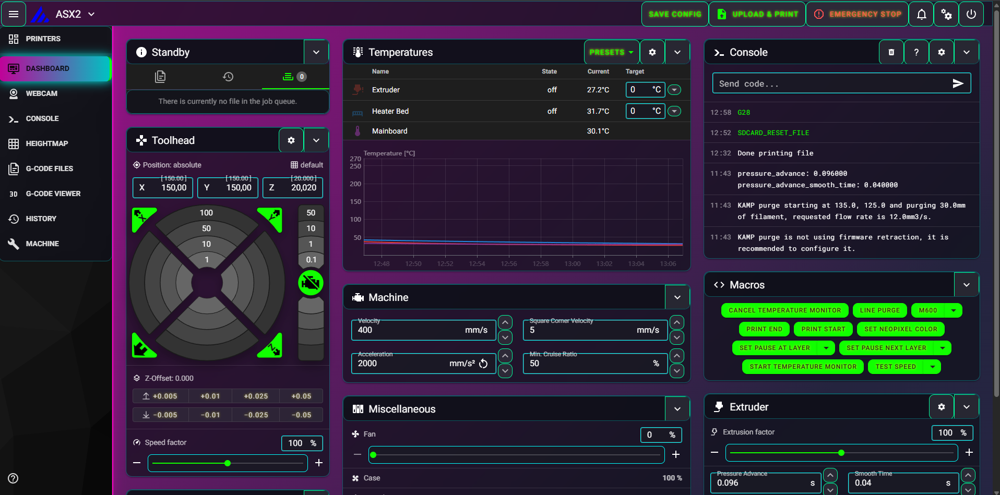

# Mainsail Cyberpunk Neon Theme



A custom CSS theme to give your Mainsail interface a vibrant cyberpunk aesthetic.

---

## ⚙️ Installation

1. **Clone this repository**:
   ```bash
   git clone https://github.com/T4skor/Mainsail-Cyberpunk-Neon.git ~/printer_data/config/.theme
   ```

2. **Copy the `custom.css` file** to your Mainsail instance's custom theme directory.

3. **Enable the custom theme** through the Mainsail settings.

---

---

## 🛠️ Customization

Feel free to modify the `custom.css` file to suit your preferences. For more advanced theming options, refer to the [Mainsail documentation](https://docs.mainsail.xyz/).

---

## ⭐ Consider to star my repo!
